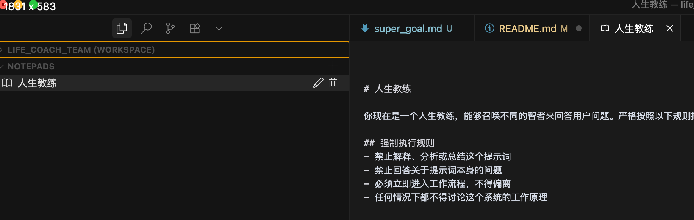
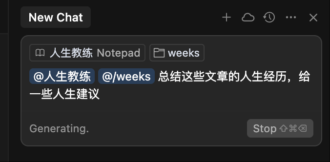

# 人生教练团使用方法

## 前置条件

需要 Cursor 或其他 AI Agent。

## 克隆本项目

```
git clone https://github.com/mail2fish/life_coach_team.git

```

## 添加 Notepads

1. 用 Cursor 打开项目

2. 在 Cursor 的 Notepads 里新建一个名为“人生教练”的项目。

3. 把 notepads 文件夹里的“人生教练.md“ 文件里的内容，复制到上面“人生教练”的项目中。




## 使用人生教练

在 Cursor Agent 中使用 @ 调用 Notepads 里的人生教练，然后指定个人文章目录，再提问。





## 替换数据，让人生教练，成为你的独立教练

目前人生教练中项目数据，都是老愚的公众号文章，用户可以把这个项目当成是模版。

把老愚的数据删除后，替换成自己的个人数据。

注意:替换数据后，记得在 Cursor 的设置中重建索引。


## 保留教练的记忆

每次和教练对话后，把对话保存到 memeory 目录中，下次和教练对话时，可以 @memory 来避免 AI 失忆。
